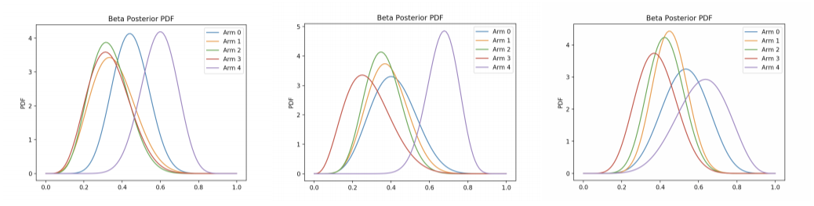

# Prediction Markets for Multi-agent Multi-armed Bandits 



Final project submission for CS 136: Economics and Computation, taught by Professor David Parkes in Fall 2018.  

(:muscle: :muscle: :muscle: :slot_machine:) x n

## Some Quick Context  
We explore the use of a prediction market (specifically a log-scoring automated market maker) to create a generative algorithm using Thompson Sampling in a multi-agent multi-armed bandit setting. Multi-armed bandits are an interesting class of problems where one wants to maximize rewards by picking any one of n possible stochastic options. An agent starts out not knowing anything, and by exploring the different options builds an internal idea of which options lead to higher rewards. As a toy model, this can generalize to various decision-making settings in the real world. However, the real world also poses additional hurdles, such as not having infinite freedom to explore, and additional opportunities, such as the existence of other agents with different experiences trying to do the same thing. We thus provide the starting code for a testing environment to see if agents can learn from the experiences of others through a prediction market.  

Our toy examples assumes an underlying Multinomial distribution of successes across 5 options. Agents assume Beta priors to try to learn the underlying parameters associated with each option.  

## Getting Started  

### Prerequisites  
* Python 3.6x  

#### Packages Used:
* numpy  
* pandas  
* scipy.stats  
* matplotlib.pyplot  

### Running the Simulation  
To run a simulation, clone the repository and run with
```
python simulation.py  
```

## Simple Component Walkthrough  
* `agent.py` - Specifies the agent class used for training and exploring.  
* `bandit.py` - Class that the agent interacts with to learn the distribution of rewards.  
* `data_simulator.py` - Generates sample data to run a simulation with. Data is fed to and presented through the bandits.  
* `environment.py` - Overall environment for training the agents and organizing prediction markets  
* `market.py` - Class for the log-scoring automated market maker prediction market mechanism  
* `policies.py` - Contains Thompson Sampling and random training policies for agents to follow  
* `simulation.py` - Called to run a simulation.  
* `utils.py`  - Plotting functions to show reward and regret  


